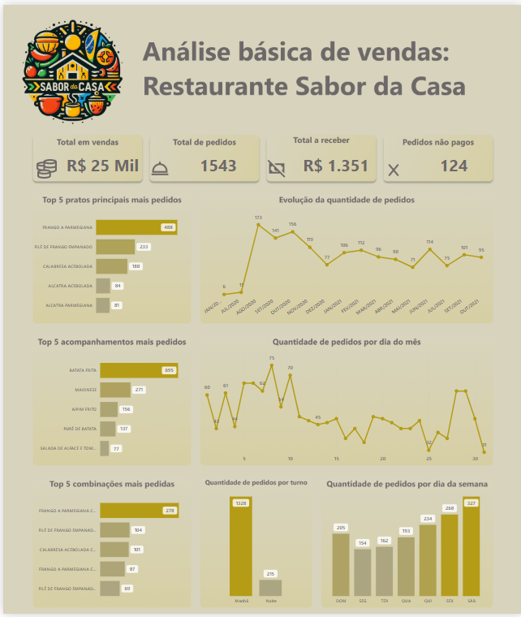

# Food Service Report

Um projeto de análise de dados para estabelecimentos alimentícios. A 'Sabor da Casa' não existe, foi criada apenas para este projeto. Os dados vêm de uma base real de um negócio local e foram anonimizados e reduzidos com o único própósito de se utilizado no projeto.

## Descrição

Este projeto consiste em um relatório analítico projetado para auxiliar estabelecimentos do setor alimentício na tomada de decisões baseadas em dados. Utilizando técnicas de análise de dados e visualização, o relatório fornece insights valiosos sobre o desempenho do negócio, tendências de vendas e preferências dos clientes.

## Funcionalidades

- Análise de vendas por período
- Identificação dos pratos mais populares
- Avaliação do desempenho de diferentes categorias de alimentos
- Análise de padrões de consumo dos clientes
- Visualizações interativas para facilitar a compreensão dos dados

## Tecnologias Utilizadas

- Python
- Pandas para manipulação de dados
- Power BI para vizualização de dados
- Figma para desenvolvimento do template do dashboard
- Jupyter Notebook para desenvolvimento e apresentação

## Contribuições

Contribuições são bem-vindas! Sinta-se à vontade para abrir issues ou enviar pull requests.
